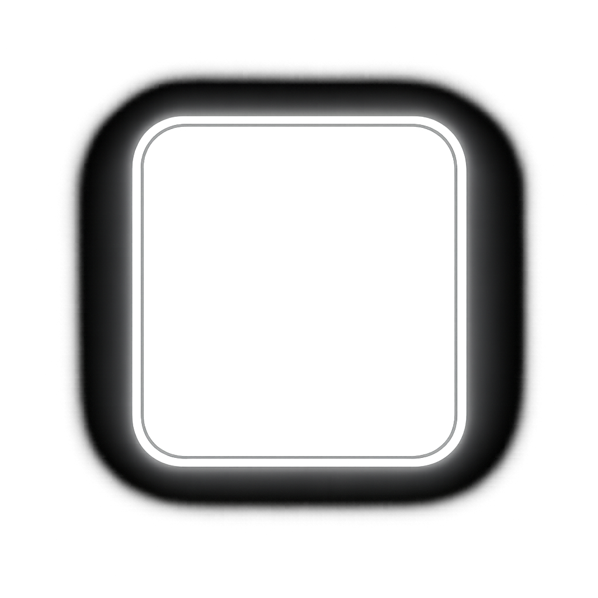

<p align="center"></p>

<h1 align="center">glow-card</h1>

<p align="center">Cursor-tracking glow border cards. Framework-agnostic Web Component. Zero dependencies.</p>

<p align="center">
  <a href="https://www.npmjs.com/package/glow-card"></a>
  <a href="https://bundlephobia.com/package/glow-card"></a>
  <a href="https://github.com/mulkatz/glow-card/blob/main/LICENSE"></a>
</p>

<p align="center"></p>

<p align="center">
  <a href="https://glow-card.mulkatz.dev"><strong>→ Live Demo</strong></a>
</p>

## Features

- **6 glow variants** — border, background, spotlight, rainbow, glow-line, pulse
- **Framework-agnostic** — Web Component works with React, Vue, Svelte, Astro, or plain HTML
- **Card groups** — proximity glow across sibling cards (the "Stripe dashboard" effect)
- **CSS Custom Properties** — full control over colors, size, blur, intensity, radius
- **Zero dependencies** — just a `<script>` tag or `npm install`
- **Tiny** — ~1.8KB gzipped (core), ~2.1KB (React wrapper incl. core)

## Install

```bash
npm install glow-card
```

## Quick Start

### Vanilla HTML

```html
<script type="module">
  import { register } from 'glow-card';
  register();
</script>

<glow-card>
  <div class="your-card">Hello World</div>
</glow-card>
```

### React

```tsx
import { GlowCard } from 'glow-card/react';

function App() {
  return (
    <GlowCard color="#6366f1" variant="border">
      <div className="your-card">Hello World</div>
    </GlowCard>
  );
}
```

## Variants

```html
<glow-card variant="border">...</glow-card>      <!-- Default: glowing border -->
<glow-card variant="background">...</glow-card>   <!-- Subtle background illumination -->
<glow-card variant="spotlight">...</glow-card>     <!-- Focused spotlight beam -->
<glow-card variant="rainbow">...</glow-card>       <!-- Rainbow gradient border -->
<glow-card variant="glow-line">...</glow-card>     <!-- Rotating glow line -->
<glow-card variant="pulse">...</glow-card>         <!-- Pulsating glow -->
```

## Card Groups

Wrap cards in `<glow-card-group>` for proximity-based glow across all cards:

```html
<glow-card-group>
  <glow-card><div class="card">Card A</div></glow-card>
  <glow-card><div class="card">Card B</div></glow-card>
  <glow-card><div class="card">Card C</div></glow-card>
</glow-card-group>
```

## Customization

All visual properties are configurable via CSS Custom Properties:

```css
glow-card {
  --glow-color: #6366f1;        /* Glow color */
  --glow-size: 200px;           /* Glow radius */
  --glow-blur: 40px;            /* Blur amount */
  --glow-border-width: 1px;     /* Border thickness */
  --glow-intensity: 1;          /* Opacity multiplier (0-1) */
  --glow-radius: 12px;          /* Card border radius */
  --glow-transition: opacity 0.3s ease;  /* Fade transition */
}
```

## API Reference

### Web Component

| Attribute | Type | Default | Description |
|-----------|------|---------|-------------|
| `variant` | `string` | `"border"` | Glow variant: `border`, `background`, `spotlight`, `rainbow`, `glow-line`, `pulse` |
| `disabled` | `boolean` | `false` | Disable the glow effect |

### React — `<GlowCard>`

```tsx
<GlowCard
  variant="border"        // Glow variant
  color="#6366f1"          // Glow color
  size={200}               // Glow radius in px
  blur={40}                // Blur in px
  borderWidth={1}          // Border thickness in px
  intensity={1}            // Opacity multiplier (0-1)
  radius={12}              // Border radius in px
  disabled={false}         // Disable glow effect
  className="my-card"      // Additional CSS class
  style={{ padding: 24 }}  // Additional inline styles
/>
```

### React — `<GlowCardGroup>`

```tsx
import { GlowCard, GlowCardGroup } from 'glow-card/react';

<GlowCardGroup className="grid" style={{ gap: '1.5rem' }}>
  <GlowCard color="#6366f1">...</GlowCard>
  <GlowCard color="#6366f1">...</GlowCard>
</GlowCardGroup>
```

| Prop | Type | Description |
|------|------|-------------|
| `className` | `string` | Additional CSS class |
| `style` | `CSSProperties` | Additional inline styles |
| `children` | `ReactNode` | GlowCard components |

## Browser Support

Works in all modern browsers (Chrome 111+, Firefox 108+, Safari 15.4+, Edge 111+). The glow-line and rainbow variants use CSS `atan2()` trigonometric functions which require these minimum versions.

## License

MIT
